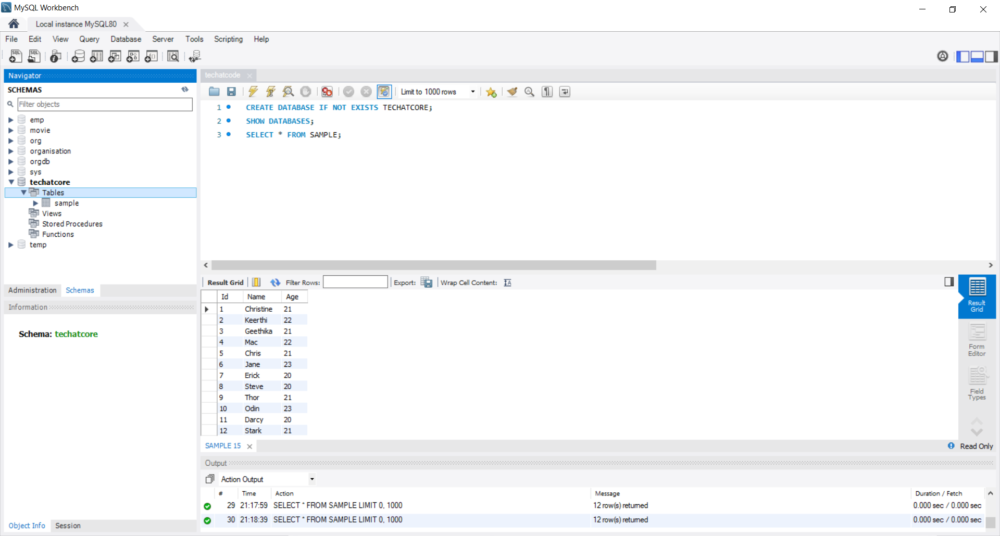

 <h1>Multiple Row Updation using Node.js and MySQL</h1>
    <ol>
        <li>Create a MySQL database and import data from an Excel sheet using the Table Data Import Wizard.</li>
        <li>Initialize a new Node.js project using 'npm init' and install necessary packages.</li>
        <li>Import necessary packages.</li>
        <li>Load environment variables from a .env file.</li>
        <li>Create a readline interface for user input.</li>
        <li>Create a MySQL database connection.</li>
        <li>Connect to the MySQL database.</li>
        <li>Prompt the user for an SQL query and execute the SQL query.</li>
        <li>Fetch table data and export it to Excel.</li>
        <li>Create a new workbook and worksheet.</li>
        <li>Append the worksheet to the workbook.</li>
        <li>Define the Excel file name.</li>
        <li>Write the workbook to a file.</li>
        <li>Run the command <strong>'npm start'</strong> to start the application and enter the query.</li>
    </ol>
    <h4>Here is a picture of MySQL Workbench which includes the Excel sheet information in the form of a table named Sample:</h4>
    
